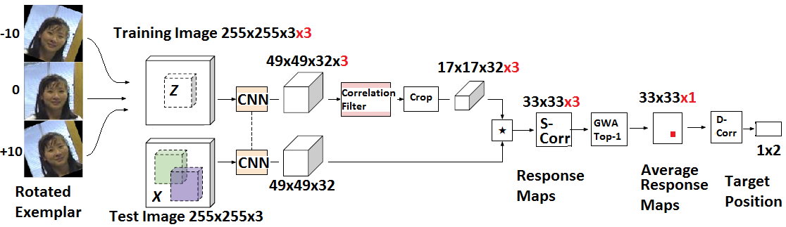

## Rotation Adaptive Visual Object Tracking with Motion Consistency
- - - -
WACV published Paper : <https://ieeexplore.ieee.org/document/8354224>

The code in this repository is built upon the work done by Luca Bertinetto et al. in "Fully-Convolutional Siamese Networks for Object Tracking". We thank Luca and his co-authors for making their code public. It helped us build the baseline for participating in the visual object tracking challenge. It is expected to reproduce the results reported in our WACV [paper](https://arxiv.org/abs/1709.06057). For execution of our tracker `SiameseFC-DSR`, please follow the instructions given below.
- - - -
SiameseFC-DSR
- - - -


- - - -
CFNet-DSR
- - - -

- - - -
If you find our work useful, please cite:
```
@INPROCEEDINGS{rout2018rotation,
	title={Rotation Adaptive Visual Object Tracking with Motion Consistency}, 
	author={Rout, Litu and Sidhartha and Manyam, Gorthi RKSS and Mishra, Deepak}, 
	booktitle={2018 IEEE Winter Conference on Applications of Computer Vision (WACV)},
	year={2018},
	pages={1047-1055},
	month={March}}
```
- - - -

[ **Tracking only** ] If you don't care much about training, simply plug one of our pretrained networks to our basic tracker and see it in action.
  1. Prerequisites: GPU, CUDA drivers, [cuDNN](https://developer.nvidia.com/cudnn), Matlab (we used 2016b), [MatConvNet](http://www.vlfeat.org/matconvnet/install/) (we used `v1.0-beta24`).
  2. Clone the repository.
  3. Download one of the pretrained networks from <http://www.robots.ox.ac.uk/~luca/siamese-fc.html>
  4. Go to `SiameseFC-DSR/tracking/` and edit `env_paths_tracking.m`, `startup.m` appropriately.
  5. Be sure to have at least one video sequence in the required format. You can find an example here in the repository (`SiameseFC-DSR/demo-sequences/vot15_bag`).
  6. `SiameseFC-DSR/tracking/tracker.m` is the entry point to execute the tracker, have fun! Alternatively, one can edit `run_tracker.m` to call the `tracker.m` function and execute the tracker.

 [ **Training and tracking** ] We have not trained our model from scratch, therefore we request the reader to follow the instructions of original SiameseFC [training and tracking] (https://github.com/bertinetto/siamese-fc) in order to train the model.

Note: The hyper parameters in the provided code may not be exactly what we have used for our evaluation. The exact hyper-parameters are given in the paper. The code is suitable for understanding the key contributions.
`This work can only be used for research purposes. For commercial use of this work, please contact the authors.`
